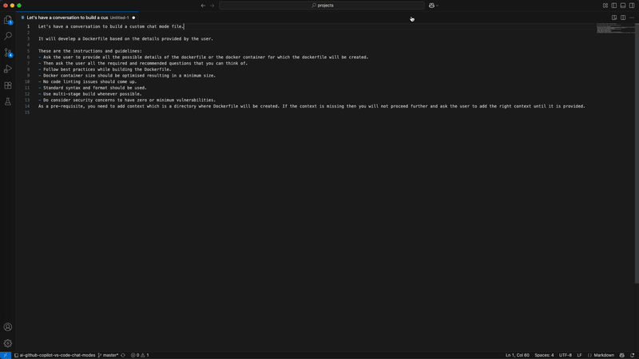

# ✨ AI GitHub Copilot VS Code Chat Modes

- Founder: [Abdullah Khawer - LinkedIn](https://www.linkedin.com/in/abdullah-khawer)

# Introduction

A curated collection of custom chat modes based on `chatmode.md` files for Visual Studio Code (VS Code) used by GitHub Copilot to enhance your development using AI to work smarter.

Custom chat modes allow you to modify GitHub Copilot's behavior in VS Code. Each `chatMode.md` file builds a specialized AI assistant with targeted knowledge and abilities for your development work, significantly cutting development time by eliminating repetitive manual tasks.

# Official Documentation

- [GitHub Copilot Chat](https://code.visualstudio.com/docs/copilot/chat/copilot-chat)
- [Custom Chat Modes](https://code.visualstudio.com/docs/copilot/chat/chat-modes#_custom-chat-modes)

# 🚀 Available Chat Modes

| Title | Description | Category |
| ----- | ----------- | -------- |
| [Code Reviewer](chat-modes/code-reviewer.chatmode.md) | Analyzes code changes between two branches to perform comprehensive code reviews and suggest improvements for security, performance, and code quality | Development Tools |
| [Code Commit Assistant](chat-modes/code-commit-assistant.chatmode.md) | Analyzes code changes, prepares conventional commit messages, and commits to a new branch with proper Git workflow automation | Development Tools |
| [Dockerfile Developer](chat-modes/dockerfile-developer.chatmode.md) | Develops optimized, secure, and best-practice Dockerfiles based on user requirements and application context | Infrastructure & DevOps |
| [Terraform Helm Release Upgrade Analyser](chat-modes/terraform-helm-release-upgrade-analyser.chatmode.md) | Creates a detailed upgrade plan for a Helm release created via Terraform by analysing the configuration differences between the current and desired Helm chart versions and any breaking changes | Infrastructure & DevOps |
| [Conversation to Chat Mode](chat-modes/conversation-to-chat-mode.chatmode.md) | Creates a custom chat mode file based on a conversational interface where users describe their specific task requirements and guidelines | Development Tools |

## Code Reviewer

This chat mode helps you perform comprehensive code reviews by analyzing changes between Git branches and providing detailed feedback by:

- **Branch Comparison**: Analyzes code differences between source and target branches using Git diff
- **Security Analysis**: Checks for secrets exposure, SQL injection vulnerabilities, and security best practices
- **Performance Review**: Identifies inefficient algorithms, memory leaks, and unnecessary computations
- **Code Quality**: Looks for code smells, duplicate code, complex functions, and formatting issues
- **Best Practices**: Verifies proper error handling, logging, and documentation standards
- **Targeted Suggestions**: Provides specific code snippets with improvements, file paths, and line numbers

### Demo


## Code Commit Assistant

This chat mode helps you automate your Git workflow by analyzing code changes and creating proper commits by:

- **Automatic Code Analysis**: Analyzes all uncommitted changes to understand the scope and impact of modifications
- **Conventional Commits**: Automatically determines the appropriate conventional commit type (feat, fix, docs, etc.) based on code changes
- **Branch Management**: Creates new branches for your changes following Git best practices
- **Quality Checks**: Optionally runs pre-commit hooks and Terraform formatting before committing
- **Automated Workflow**: Handles the complete Git workflow from branch creation to pushing changes

### Demo


## Dockerfile Developer

This chat mode helps you create optimized, secure, and production-ready Dockerfiles by:

- **Context Analysis**: Analyzes your project files to understand dependencies and build requirements
- **Best Practices**: Follows Docker best practices including proper layer ordering, caching optimization, and clean syntax
- **Size Optimization**: Creates minimal container images through multi-stage builds and efficient package management
- **Security Focus**: Implements security best practices including non-root users and vulnerability scanning
- **Technology Detection**: Automatically detects your application stack from project files (package.json, requirements.txt, etc.)

### Demo


## Terraform Helm Release Upgrade Analyser

This chat mode helps you safely upgrade Helm releases managed by Terraform by:

- **Automatic Detection**: Scans your Terraform code to identify Helm release resources
- **Version Comparison**: Compares template files and default values between chart versions
- **Breaking Change Analysis**: Identifies potential breaking changes and compatibility issues
- **Detailed Planning**: Creates comprehensive upgrade plans with step-by-step instructions

### Demo


## Conversation to Chat Mode

This meta chat mode helps you create new custom chat modes through a guided conversation by:

- **Interactive Creation**: Walks you through a conversational interface to define your chat mode requirements
- **Template Generation**: Automatically generates properly formatted `.chatmode.md` files based on your inputs
- **Guided Questions**: Asks targeted questions about your specific task and required guidelines
- **Best Practices**: Ensures your custom chat mode follows established conventions and formatting

### Demo



# 📖 How to Use Chat Modes

To use any of these custom chat modes effectively, follow these general steps:

## Prerequisites

- Ensure you have the necessary files, projects, or context ready for the specific chat mode you want to use
- Understand the specific requirements for your chosen chat mode by checking the chat mode file.

## Setup

1. **Install the Chat Mode**: Copy the desired `.chatmode.md` file from the `/chat-modes` directory to your workspace's `.github/chatmodes` directory
2. **Restart VS Code**: Restart VS Code to load the new chat mode
3. **Start a New Chat Session**: Open the GitHub Copilot Chat panel in VS Code
4. **Select the Chat Mode**: Click the dropdown menu at the bottom of the chat panel and select your custom chat mode
5. **Choose the Model**: Select the model to be used. For example, `Claude Sonnet 4` (recommended for best performance)
6. **Add Context**: Choose the appropriate directory or files as context for your specific task

## Prompt Example

### Simple Start Command

For most chat modes, you can simply use:

```
Start.
```

This will prompt the chat mode to guide you through any necessary questions or steps.

## Tips for Best Results

- Always select the appropriate directory or files as context for your task
- Use `Claude Sonnet 4` model for optimal performance
- Be specific about your requirements when the chat mode asks for clarification
- Ensure you have the necessary permissions and prerequisites before starting

**Note: For more details, refer to the chosen custom chat mode's `.chatmode.md` file.**

# 🤝 Contributing

Contributions are welcome! If you have a custom chat mode you'd like to share:

1. Fork this repository
2. Create a new `.chatmode.md` file in the `chat-modes` directory
3. Update this README.md to include your chat mode in the table
4. Submit a pull request

# Chat Mode Guidelines

- Use descriptive names and clear descriptions
- Include comprehensive documentation and usage examples
- Test your chat mode thoroughly before submitting
- Follow the established file naming convention: `your-mode-name.chatmode.md`

# 📝 License

This project is licensed under the Apache License - see the [LICENSE](LICENSE) file for details.

---

###### 😊 Any contributions, improvements and suggestions will be highly appreciated.

###### 🌟 Star this repository to know about awesome new chat modes for VS Code.
